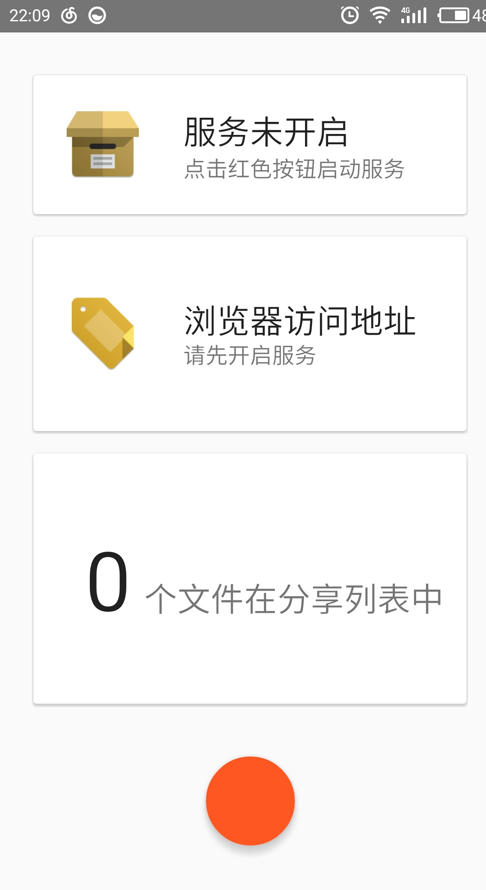
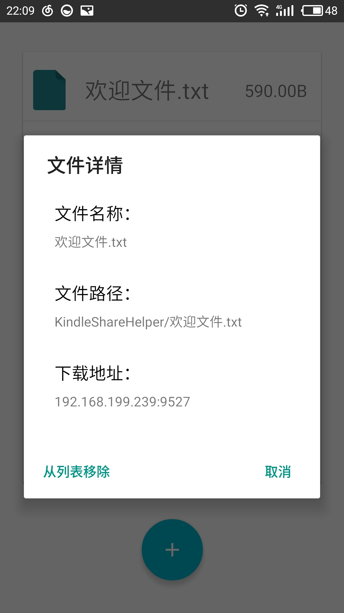
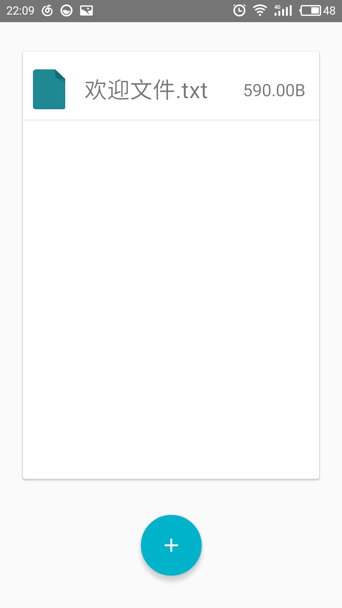
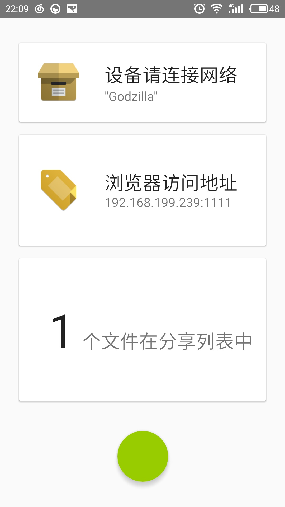
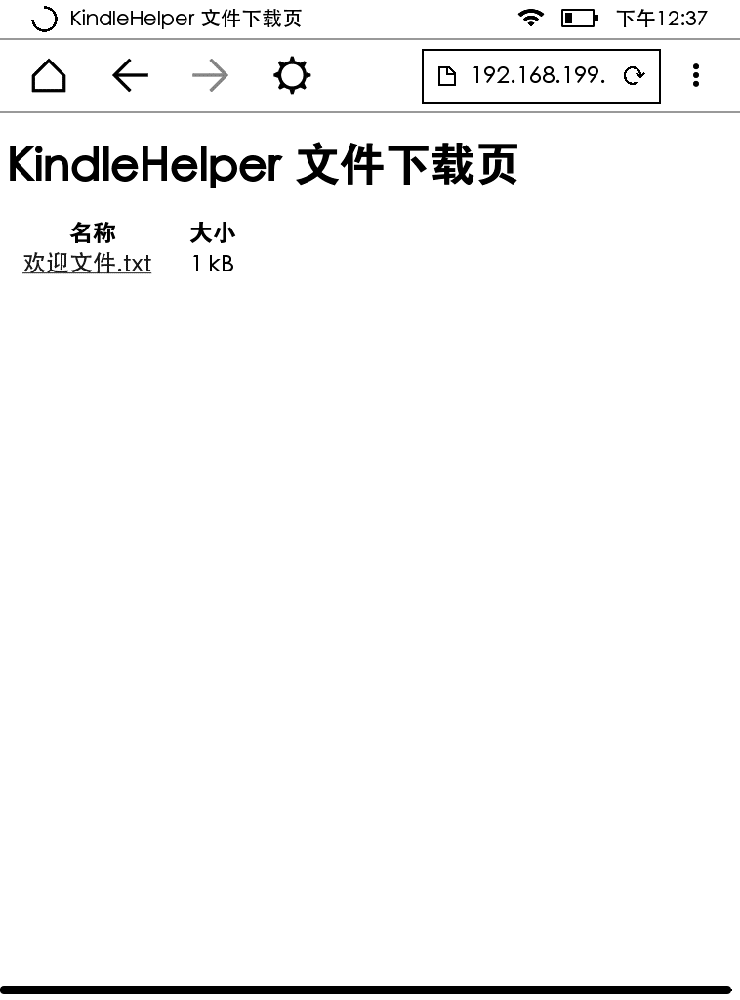

# KindleHelper Kindle助手
使用HttpServer，将Android作为一个Http服务器并以此将电子书和各种文件分享给Kindle

## 模块化设计
- 使用了NanoHttp（2.2版本） 构建文件服务器
- 使用了FileChooseUtil（Beta ） 作为内嵌的文件选择器
- 使用了HeiPermission 完成Android 6.0以上的动态权限申请事务

## 使用环境
- Android 5.1 或以上

## 版本更新

### V 1.0 
[下载链接](kindleShareHelper-release-v1.0.apk)
- 增加了文件详情Dialog，以及移出文件列表功能
- 修复wifi热点开启时无法获取IPV4的功能
- 修复了Android6.0 上动态权限获取问题
- 增加了网络状态判断
- 优化了界面，增加了设备连接指引
- 增加了文件分享功能，能够在其他应用直接分享到KindleShareHelper（目前仅仅支持少量文件类型）
- 重绘了图标

### bata
- 实现了基础的分享功能
- 文件添加功能完整

## 运行截图

